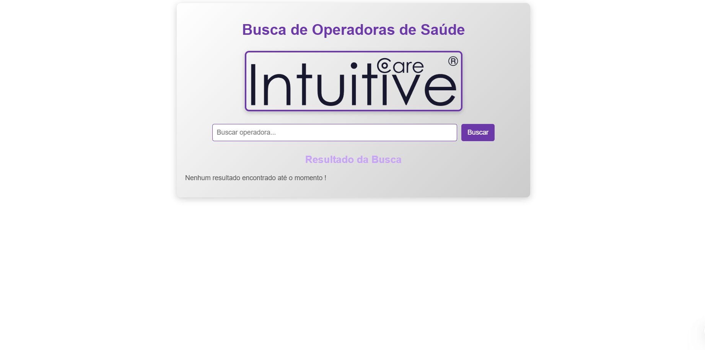

# TESTES DE NIVELAMENTO v.250321 - INTUITIVE CARE

Este repositório contém a implementação dos testes de nivelamento, abordando os seguintes testes:

- **Teste de Web Scraping**
- **Teste de Transformação de Dados**
- **Teste de Banco de Dados**
- **Teste de API**

**Opcional:** Antes de executar os arquivos `.py`, você pode excluir as pastas `downloads`, `resultados` e `downloads_ftp` para visualizar o sistema realizando as tarefas solicitadas.

---

## 1. TESTE DE WEB SCRAPING

Este teste foi desenvolvido utilizando **Python**. Ao executar o arquivo `scraping.py` dentro da pasta `TESTE-DE-WEB-SCRAPING`, são realizadas as seguintes funcionalidades:

1. **Acesso ao site oficial da ANS**
   - URL: [Atualização do Rol de Procedimentos](https://www.gov.br/ans/pt-br/acesso-a-informacao/participacao-da-sociedade/atualizacao-do-rol-de-procedimentos)

2. **Download dos anexos I e II em formato PDF**
   - O script baixa automaticamente os arquivos e os armazena na pasta `downloads`.

3. **Compactação dos anexos**
   - Todos os arquivos são compactados em um único arquivo ZIP na pasta `downloads`.

---

## 2. TESTE DE TRANSFORMAÇÃO DE DADOS

Este teste foi desenvolvido utilizando **Python**. Ao executar o arquivo `transformacao_dados.py` dentro da pasta `TESTE-DE-TRANSFORMAÇÃO-DE-DADOS`, são realizadas as seguintes funcionalidades:

1. **Extração dos dados do PDF**
   - Os dados da tabela **"Rol de Procedimentos e Eventos em Saúde"** do PDF `Anexo_I_Rol_2021RN_465.2021_RN627L.2024`, baixado anteriormente na pasta `downloads`, são extraídos de todas as páginas.

2. **Geração de CSV estruturado**
   - Os dados extraídos são salvos em um arquivo CSV dentro da pasta `resultados`.

3. **Compactação do CSV**
   - O arquivo CSV é compactado dentro da pasta `resultados` como `Teste_francisco_fernando.zip`.

4. **Substituição de abreviações**
   - As colunas **"OD"** e **"AMB"** são substituídas por **Seg. Odontológica** e **Seg. Ambulatorial**, respectivamente.

---

## 3. TESTE DE BANCO DE DADOS

Ao executar o arquivo `teste_banco.py`, são realizadas as seguintes funcionalidades:

1. **Download de dados:**
   - Arquivos dos últimos **2 anos** do repositório público:
     - [Demonstrações contábeis](https://dadosabertos.ans.gov.br/FTP/PDA/demonstracoes_contabeis/)
   - Dados cadastrais das Operadoras Ativas na ANS no formato CSV:
     - [Operadoras Ativas na ANS](https://dadosabertos.ans.gov.br/FTP/PDA/operadoras_de_plano_de_saude_ativas/)
   - Os dados baixados são armazenados na pasta `downloads_ftp`, organizados por ano. O arquivo `Relatorio_cadop.csv` é armazenado na subpasta `operadoras`.

2. **Queries**
   - Scripts SQL compatíveis com **PostgreSQL >10** foram desenvolvidos na pasta `scripts`, as queries do arquivo `queries.sql` foram desenvolvidas a partir do arquivo dicionário de cada link das páginas informadas e adaptado para os dados do arquivo `Relatorio_cadop.csv`:
     - `queries.sql` (modelo para estruturar e importar dados).
     - `analise_ano.sql` e `analise_trimestre.sql` (modelo de queries analíticas para responder às perguntas do item 3.5 do teste).

### 3.1 - TESTE DE BANCO DE DADOS - Arquivo `connect_banco.py`

Ao configurar o arquivo `.env` com suas credenciais e executar o arquivo `connect_banco.py`, são realizadas as seguintes funcionalidades:

1. **Conexão com o PostgreSQL**
   - O arquivo `connect_banco.py` é configurado para se conectar ao **PostgreSQL**.

2. **Criação de banco e tabelas**
   - Caso o banco **"intuitive"** não exista, ele é criado automaticamente.
   - Se o banco existir, as tabelas **operadoras** e **despesas** são criadas.
   - O arquivo `Relatorio_cadop.csv` é importado para a tabela **operadoras**.

---

## 4. TESTE DE API

As pastas `teste-de-api-interface` e `TESTE-DE-API` contêm a interface e a API responsáveis por realizar buscas textuais na lista de cadastros de operadoras do arquivo `Relatorio_cadop.csv`.

Para executar corretamente:

1. **Inicie a interface Vue.js** dentro da pasta `teste-de-api-interface`.
2. **Execute o arquivo `app.py`** dentro da pasta `TESTE-DE-API` para que a API processe as buscas.

## 🖥️ Preview da Aplicação  

- Não irei colocar preview com os resultados pois contém dados confidenciais.

3. **Coleção Postman** no arquivo `Busca de Operadoras de Saúde.postman_collection.json` para demonstrar o resultado da busca por `Odontologia de Grupo`.

---

## Observação

Este documento é **confidencial** e não deve ser compartilhado sem autorização.

